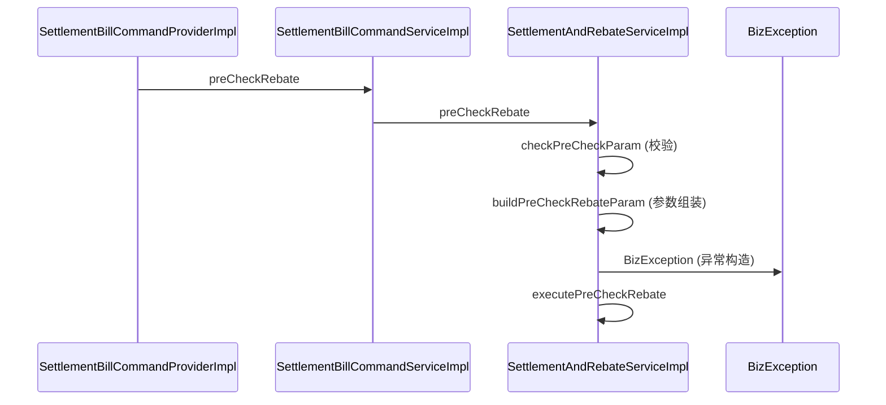

# code-flowchart 实现计划

> **For agentic workers:** REQUIRED SUB-SKILL: Use superpowers:subagent-driven-development (recommended) or superpowers:executing-plans to implement this plan task-by-task. Steps use checkbox (`- [ ]`) syntax for tracking.

**Goal:** 实现 `code-flowchart` SKILL —— 只消费 `code.explore_symbol` 返回的 `ExploreResponse.main_paths`，渲染成自包含 HTML 调用链可视化（内联 mermaid.js），每个 entry 输出**两张互补图**：简化流程图（主线骨架）+ 详细时序图（含折叠细节），并诚实标注 verified/candidate、coverage、entry/exit。

**Architecture:** 展示层 SKILL。Agent 运行时产出「两份 Mermaid 定义（flowchart + sequenceDiagram）+ config JSON」，填入预置 `templates/flowchart.html`（内联 mermaid.js + 固定 UI chrome）。Mermaid 负责画图（flowchart 画结构、sequenceDiagram 画时序），HTML 层负责 coverage banner、entry/exit 徽标、tab 切换、图例。

**Tech Stack:** Mermaid v11（内联 min.js，同时支持 flowchart 与 sequenceDiagram）、原生 HTML/CSS/JS（无构建步骤）、Markdown（SKILL.md + references）。

**设计文档：** `Skill/code-flowchart/docs/2026-09-17-code-flowchart-design.zh-CN.md`

**仓库约定：** 技能位于 `Skill/code-flowchart/`，设计/计划放 `docs/`，模板放 `templates/`，映射表放 `references/`，示例放 `examples/`。参考 `Skill/api-flow`、`Skill/online-troubleshoot`。

---

## 文件结构总览

| 文件 | 职责 |
|---|---|
| `Skill/code-flowchart/SKILL.md` | frontmatter + 工作流 + 诚实展示规则 |
| `Skill/code-flowchart/templates/flowchart.html` | 自包含 HTML 模板（内联 mermaid.js + UI chrome + tab 切换） |
| `Skill/code-flowchart/templates/flowchart-config.schema.md` | config JSON 字段契约 |
| `Skill/code-flowchart/references/role-color-mapping.md` | 角色桶 → 颜色/classDef（流程图用） |
| `Skill/code-flowchart/references/relation-label-mapping.md` | relation_type → 边标签 |
| `Skill/code-flowchart/references/sequence-diagram-mapping.md` | folded_steps → 时序图消息映射 |
| `Skill/code-flowchart/references/explore-symbol-fields.md` | 引用 schema-contract 关键字段 |
| `Skill/code-flowchart/examples/precheck-rebate.md` | golden case（输入 → 期望输出） |

---

## Task 1: golden case（先写验收标准）

**Files:**
- Create: `Skill/code-flowchart/examples/precheck-rebate.md`

- [ ] **Step 1: 写 golden case 文档（定义「正确输出」）**

````markdown
# Golden Case: preCheckRebate 调用链

## 输入：ExploreResponse（截取 main_paths 关键字段）

```json
{
  "project": { "name": "intl-scheme" },
  "query": { "type": "symbol", "text": "preCheckRebate" },
  "coverage": { "complete": false, "relation_budget_reached": true, "note": "本次返回预算内候选主链路" },
  "main_paths": [
    {
      "id": "main_path_1",
      "path_status": "verified",
      "confidence": "medium",
      "entry_symbol": "SettlementBillCommandProviderImpl.preCheckRebate",
      "exit_symbol": "SettlementAndRebateServiceImpl.executePreCheckRebate",
      "nodes": [
        { "id": "n1", "symbol": "SettlementBillCommandProviderImpl.preCheckRebate", "location_type": "service", "file": "src/main/java/.../SettlementBillCommandProviderImpl.java", "start_line": 88 },
        { "id": "n2", "symbol": "SettlementBillCommandServiceImpl.preCheckRebate", "location_type": "service", "file": "src/main/java/.../SettlementBillCommandServiceImpl.java", "start_line": 55 },
        { "id": "n3", "symbol": "SettlementAndRebateServiceImpl.preCheckRebate", "location_type": "service", "file": "src/main/java/.../SettlementAndRebateServiceImpl.java", "start_line": 120 },
        { "id": "n4", "symbol": "SettlementAndRebateServiceImpl.executePreCheckRebate", "location_type": "service", "file": "src/main/java/.../SettlementAndRebateServiceImpl.java", "start_line": 200 }
      ],
      "relations": [
        { "from": "n1", "to": "n2", "relation_type": "calls" },
        { "from": "n2", "to": "n3", "relation_type": "calls" },
        { "from": "n3", "to": "n4", "relation_type": "calls" }
      ],
      "folded_steps": [
        { "parent_node_id": "n3", "node": { "symbol": "SettlementAndRebateServiceImpl.checkPreCheckParam" }, "reason": "validation" },
        { "parent_node_id": "n3", "node": { "symbol": "SettlementAndRebateServiceImpl.buildPreCheckRebateParam" }, "reason": "parameter_assembly" },
        { "parent_node_id": "n3", "node": { "symbol": "BizException.BizException" }, "reason": "exception_construction" }
      ]
    }
  ]
}
```

## 期望输出（验收断言）

### 简化流程图（flowchart）

1. **节点顺序**：`ProviderImpl.preCheckRebate → CommandServiceImpl.preCheckRebate → SettlementAndRebateServiceImpl.preCheckRebate → executePreCheckRebate`。
2. **节点标签含类名**：每个节点 label 形如 `SettlementAndRebateServiceImpl.preCheckRebate`（无裸方法名）。
3. **不含折叠细节**：`checkPreCheckParam` / `buildPreCheckRebateParam` / `BizException` **不出现在流程图节点/边里**（只在 `+N folded` 徽标）。
4. **entry/exit 徽标**：`▶ Entry: SettlementBillCommandProviderImpl.preCheckRebate` + `■ Exit: SettlementAndRebateServiceImpl.executePreCheckRebate`。
5. **verified 线型**：`path_status=verified` → 实线边。
6. **coverage banner**：`complete=false` → 醒目「候选主流程，非完整运行时调用链」。

### 详细时序图（sequenceDiagram）

7. **participants**：`SettlementBillCommandProviderImpl`、`SettlementBillCommandServiceImpl`、`SettlementAndRebateServiceImpl`、`BizException`。
8. **主线消息**：`P->>C: preCheckRebate`、`C->>S: preCheckRebate`、`S->>S: executePreCheckRebate`。
9. **折叠细节消息**（按顺序）：`S->>S: checkPreCheckParam (校验)`、`S->>S: buildPreCheckRebateParam (参数组装)`、`S->>BizException: BizException (异常构造)`。
10. **+3 folded**：简化流程图有 `+3 folded` 徽标；时序图把 3 项细节展开为消息。

参考时序图：


````

- [ ] **Step 2: 自检 golden case 覆盖设计规格**

对照设计 6.1~6.9 逐条确认。缺失项记录并在后续 Task 补上对应实现。

- [ ] **Step 3: 提交**

```bash
cd /mnt/g/my-Skill
git add Skill/code-flowchart/examples/precheck-rebate.md
git commit -m "docs(code-flowchart): add precheck-rebate golden case"
```

---

## Task 2: 角色颜色映射表

**Files:**
- Create: `Skill/code-flowchart/references/role-color-mapping.md`

- [ ] **Step 1: 写映射表（实际内容）**

```markdown
# 角色 → 颜色映射

流程图节点按「角色桶」着色。映射顺序：先按 `location_type`，再按 `symbol` 命名后缀兜底。

| 角色桶 | location_type | 命名后缀兜底 | mermaid classDef | 颜色语义 |
|---|---|---|---|---|
| entry | controller / route / dubbo_provider | Provider / Controller / Scheduler / Consumer / Listener / Handler / Job / Facade | `classDef entry fill:#e8f5e9,stroke:#2e7d32,stroke-width:2px,color:#1b5e20` | 绿 = 入口 |
| business | service / dubbo_interface | Service / Manager / Processor / Executor / CommandService / DomainService / ApplicationService | `classDef business fill:#e3f2fd,stroke:#1565c0,stroke-width:2px,color:#0d47a1` | 蓝 = 业务 |
| persistence | mapper / sql | Repository / Mapper / Dao | `classDef persistence fill:#fff3e0,stroke:#e65100,stroke-width:2px,color:#bf360c` | 橙 = 持久化 |
| other | config / constant / enum / exception / log_statement / test / unknown | （其余） | `classDef other fill:#eceff1,stroke:#607d8b,stroke-width:1px,color:#37474f` | 灰 = 其他 |

判定伪代码：

```text
function roleOf(location):
  if location.location_type in {controller, route, dubbo_provider}: return entry
  if location.location_type in {service, dubbo_interface}: return business
  if location.location_type in {mapper, sql}: return persistence
  # 命名兜底（location_type 缺失或 unknown 时）
  name = location.symbol or ""
  if name matches /(Provider|Controller|Scheduler|Consumer|Listener|Handler|Job|Facade)$/: return entry
  if name matches /(Service|Manager|Processor|Executor)$/: return business
  if name matches /(Repository|Mapper|Dao)$/: return persistence
  return other
```

每个角色桶在 Mermaid 源里生成一条 `classDef`，并把对应节点 id 用 `class n1,n2 entry` 归属。
```

- [ ] **Step 2: 提交**

```bash
cd /mnt/g/my-Skill
git add Skill/code-flowchart/references/role-color-mapping.md
git commit -m "docs(code-flowchart): add role-to-color mapping"
```

---

## Task 3: 关系边标签映射表

**Files:**
- Create: `Skill/code-flowchart/references/relation-label-mapping.md`

- [ ] **Step 1: 写映射表（实际内容）**

```markdown
# relation_type → 边标签映射

边标签取 `CodeRelation.relation_type`（归一化类型，见 schema-contract 6.8）。映射如下：

| relation_type | 边标签 | 备注 |
|---|---|---|
| calls | calls | 强（执行链路） |
| method_implements | implements | 强 |
| method_overrides | overrides | 强 |
| maps_to_sql | → SQL | 中强 |
| uses_table | uses table | 中强 |
| handles_route | handles | 中 |
| throws | throws | 中 |
| logs | logs | 中 |
| reads_config | reads config | 中 |
| has_method | has method | 中 |
| has_property | has property | 中 |
| extends | extends | 中 |
| contains | contains | 中 |
| imports | imports | 弱（静态依赖） |
| accesses | accesses | 弱 |
| typed_as | typed as | 弱 |
| references | references | 弱（兜底降级） |

Mermaid 流程图边语法：`A -- "calls" --> B` 或 `A -->|calls| B`。

> 注意：v0.5 已把 `main_path.relations` 精简到 3 种强关系（calls / method_implements / maps_to_sql），
> 主链路流程图绝大多数边都是 `calls`。其余类型仅当 fallback 或审计展开时出现。
```

- [ ] **Step 2: 提交**

```bash
cd /mnt/g/my-Skill
git add Skill/code-flowchart/references/relation-label-mapping.md
git commit -m "docs(code-flowchart): add relation-label mapping"
```

---

## Task 4: 时序图映射表

**Files:**
- Create: `Skill/code-flowchart/references/sequence-diagram-mapping.md`

- [ ] **Step 1: 写映射表（实际内容）**

```markdown
# folded_steps → 时序图消息映射

详细时序图（`sequenceDiagram`）把折叠细节展开为消息。映射规则：

## 1. participants

`main_path.nodes` 的类名去重 + `folded_steps` 的目标类名去重，按首次出现顺序。

类名 = `symbol` 里 `.` 前最后一段的简单类名（剥包前缀）。

```text
participant P as SettlementBillCommandProviderImpl
participant S as SettlementAndRebateServiceImpl
```

## 2. 主线消息

对每条 relation（from→to），发一条消息，label = to 节点的简单方法名：

```text
FromClass ->> ToClass: calledMethod
```

若 from/to 同类 → 自调用：`S ->> S: executePreCheckRebate`。

## 3. 折叠细节消息

对每个有 folded_steps 的主节点，在它发出**下一条主线消息前**，按 folded_steps 顺序发消息：

- 同类折叠（folded 节点类 == 父节点类）：`Parent ->> Parent: method (reason标签)`
- 跨类折叠（folded 节点类 != 父节点类）：`Parent ->> FoldedClass: method (reason标签)`

reason 标签映射：

| reason | 标签 |
|---|---|
| validation | 校验 |
| parameter_assembly | 参数组装 |
| lock | 锁 |
| exception_construction | 异常构造 |
| dto_accessor | DTO访问 |
| utility | 工具 |
| test | 测试 |
| low_priority_detail | 细节 |

## 4. 代码位置（可选）

`Note right of X: file:line` 标注，避免过密。

## 5. 边界

- **side_relations 不进时序图**：imports / test_noise 是噪声，不是调用链细节。
- **时序图不区分 verified/candidate 线型**（sequenceDiagram 无虚线语义），在图 header 保留徽标。
- `reason` 不在上表时回退为 `细节`。

## 6. 完整示例

输入：nodes=[P.preCheckRebate, C.preCheckRebate, S.preCheckRebate, S.executePreCheckRebate]，folded(n3)=[checkPreCheckParam(validation), buildPreCheckRebateParam(parameter_assembly), BizException(exception_construction)]

输出：


```

- [ ] **Step 2: 提交**

```bash
cd /mnt/g/my-Skill
git add Skill/code-flowchart/references/sequence-diagram-mapping.md
git commit -m "docs(code-flowchart): add sequence-diagram mapping"
```

---

## Task 5: explore_symbol 字段引用

**Files:**
- Create: `Skill/code-flowchart/references/explore-symbol-fields.md`

- [ ] **Step 1: 写字段引用（实际内容）**

```markdown
# code.explore_symbol 字段引用

本 SKILL 只消费 `ExploreResponse` 的以下字段（完整契约见 Code-intelligence `docs/schema-contract.zh-CN.md`）。

## 消费顺序（v0.4 契约，不可变）

```text
summary → main_paths（优先 high/medium）→ coverage → diagnostics
需要展开细节时读 folded_steps / side_relations；审计时读 relations / candidate_paths
```

## 主链路 MainPath（核心消费对象）

| 字段 | 类型 | 用途 |
|---|---|---|
| `entry_symbol` | string? | 入口符号，图上 `▶ Entry:` 徽标 + 分组键 |
| `exit_symbol` | string? | 出口符号，图上 `■ Exit:` 徽标 |
| `path_status` | string | verified=candidate 判定（verified=实线，其余=虚线） |
| `confidence` | high/medium/low | low 时加警示徽标 |
| `nodes[]` | CodeLocation[] | 有序节点 → 流程图节点 + 时序图 participant |
| `relations[]` | CodeRelation[] | 有序边 → 流程图边 + 时序图主线消息 |
| `folded_steps[]` | FoldedStep[] | 折叠细节 → 时序图细节消息（详见 sequence-diagram-mapping.md） |
| `summary` | string | 图标题副文案 |

## CodeLocation（节点）

| 字段 | 用途 |
|---|---|
| `symbol` | 节点标签（剥包前缀取 `ClassSimpleName.methodName`） |
| `location_type` | 角色着色主依据 |
| `file` / `start_line` | tooltip / Note 标注 |

## CodeRelation（边）

| 字段 | 用途 |
|---|---|
| `from` / `to` | 节点 id 连接 |
| `relation_type` | 边标签（见 relation-label-mapping.md） |

## coverage

| 字段 | 用途 |
|---|---|
| `complete` | false 时 banner 必须醒目标注「候选主流程，非完整运行时调用链」 |

## diagnostics

始终作为图下方可折叠清单透传（不隐藏）。尤其关注：
`MAIN_PATH_NO_STRONG_RELATION_CHAIN` / `ANCHOR_AMBIGUOUS` / `MAIN_PATH_COVERAGE_PARTIAL`。

## 硬规则（来自 schema-contract 8.2）

1. 空不等于无：`main_paths=[]` 只代表「当前无证据」。
2. 候选不等于验证：candidate 永不画成 verified。
3. 预算内不等于全量：`relations` 是预算内子集。
```

- [ ] **Step 2: 提交**

```bash
cd /mnt/g/my-Skill
git add Skill/code-flowchart/references/explore-symbol-fields.md
git commit -m "docs(code-flowchart): add explore_symbol field reference"
```

---

## Task 6: config JSON 契约

**Files:**
- Create: `Skill/code-flowchart/templates/flowchart-config.schema.md`

- [ ] **Step 1: 写 config 契约（实际内容）**

```markdown
# flowchart config JSON 契约

Agent 填入 `templates/flowchart.html` 的配置对象，运行时替换模板里的 `window.FLOWCHART_CONFIG`。

```json
{
  "title": "preCheckRebate 调用链",
  "project": "intl-scheme",
  "query": "preCheckRebate",
  "coverage": {
    "complete": false,
    "reason": "relation_budget_reached",
    "note": "候选主流程，非完整运行时调用链"
  },
  "graphs": [
    {
      "entry_symbol": "SettlementBillCommandProviderImpl.preCheckRebate",
      "exit_symbol": "SettlementAndRebateServiceImpl.executePreCheckRebate",
      "path_status": "verified",
      "confidence": "medium",
      "mermaid_flowchart": "flowchart LR\n  n1[...] -->|calls| n2[...] ...",
      "mermaid_sequence": "sequenceDiagram\n  participant P as ...\n  P->>C: preCheckRebate ...",
      "folded": [
        { "parent": "SettlementAndRebateServiceImpl.preCheckRebate", "items": ["checkPreCheckParam (校验)", "buildPreCheckRebateParam (参数组装)", "BizException (异常构造)"] }
      ]
    }
  ]
}
```

## 字段说明

| 字段 | 类型 | 必填 | 说明 |
|---|---|---|---|
| `title` | string | 是 | 页面标题 |
| `project` | string | 是 | 项目名 |
| `query` | string | 是 | 原始 query |
| `coverage.complete` | boolean | 是 | 决定 banner 颜色（true=绿，false=红黄警示） |
| `coverage.reason` | string | 否 | 不完整原因（relation_budget_reached / depth_limit_reached / fanout_limit_reached） |
| `coverage.note` | string | 是 | banner 主文案（complete=false 时固定为「候选主流程，非完整运行时调用链」） |
| `graphs[]` | array | 是 | 每个 entry_symbol 一组图 |
| `graphs[].entry_symbol` | string | 是 | `▶ Entry:` 徽标文案 |
| `graphs[].exit_symbol` | string | 否 | `■ Exit:` 徽标文案 |
| `graphs[].path_status` | string | 是 | `verified` 或 `candidate` |
| `graphs[].confidence` | string | 是 | high/medium/low |
| `graphs[].mermaid_flowchart` | string | 是 | 简化流程图 Mermaid 源（节点/边/classDef/linkStyle 已编码在内） |
| `graphs[].mermaid_sequence` | string | 是 | 详细时序图 Mermaid 源（participant/消息已编码在内） |
| `graphs[].folded[]` | array | 否 | 折叠细节，每项含 `parent` + `items[]` |

## mermaid_flowchart 编码约定（Agent 生成时遵守）

- 节点：`n1["ClassSimpleName.methodName"]`（标签带类名，无裸方法名）。
- 边：`n1 -->|calls| n2`。
- 角色着色：`classDef entry ...` + `class n1,n2 entry`。
- candidate 虚线：`linkStyle 0 stroke:#9e9e9e,stroke-width:2px,stroke-dasharray:5 5`。
- 方向：`flowchart LR`（左到右，适配演示）。
- **不包含 folded_steps**（折叠细节只进时序图）。

## mermaid_sequence 编码约定

- 见 `references/sequence-diagram-mapping.md`。
- 含主线消息 + folded 细节消息，尽量详细。
```

- [ ] **Step 2: 提交**

```bash
cd /mnt/g/my-Skill
git add Skill/code-flowchart/templates/flowchart-config.schema.md
git commit -m "docs(code-flowchart): add config schema"
```

---

## Task 7: SKILL.md

**Files:**
- Create: `Skill/code-flowchart/SKILL.md`

- [ ] **Step 1: 写 SKILL.md（实际内容）**

````markdown
---
name: code-flowchart
description: 把 Code-intelligence 的 code.explore_symbol 返回的调用链（main_paths）渲染成可视化流程图 + 时序图。Use when 用户想看到某个方法的调用链流程图、需要可视化「入口→锚点→出口」调用链、或需要演示 Code-intelligence 的调用链检索能力。输入一个 symbol 或 ExploreResponse JSON，输出自包含 HTML（简化流程图 + 详细时序图）。
---

# code-flowchart

把 `code.explore_symbol` 返回的 `ExploreResponse.main_paths` 渲染成调用链可视化（自包含 HTML，内联 mermaid.js，单文件多图）。每个 entry 输出**两张互补图**：

1. **简化流程图**（`flowchart`）：只画主线骨架，校验/参数组装/锁/DTO 等非主线细节折叠不显示。
2. **详细时序图**（`sequenceDiagram`）：把折叠细节展开为消息，尽量详细。

## 定位

展示层 SKILL。只消费 `ExploreResponse`，不修改 Code-intelligence 核心，不重新解析代码，不重跑 trace。

## 工作流

1. **拿数据**：用户给 symbol → 调 `code.explore_symbol` 拿 `ExploreResponse`；用户直接给 JSON → 跳过。
2. **读主链路**：读 `main_paths`，按 `entry_symbol` 分组（一 entry 一组图）。
3. **生成简化流程图**：节点/边按 `references/role-color-mapping.md`（着色）+ `references/relation-label-mapping.md`（边标签）生成 Mermaid `flowchart` 源；candidate 边加 `linkStyle ... stroke-dasharray`；**不含 folded_steps**。
4. **生成详细时序图**：按 `references/sequence-diagram-mapping.md` 生成 Mermaid `sequenceDiagram` 源（participants + 主线消息 + folded 细节消息）。
5. **填 config**：按 `templates/flowchart-config.schema.md` 填 `title/coverage/graphs[]`（含 `mermaid_flowchart` + `mermaid_sequence`）。
6. **渲染**：把 config 填入 `templates/flowchart.html`（替换 `window.FLOWCHART_CONFIG`），输出 HTML 文件。

## 诚实展示规则（不可变，来自 schema-contract 8.2）

- `coverage.complete=false` → banner 必须醒目写「候选主流程，非完整运行时调用链」。
- `path_status != verified` → 虚线边 + `candidate` 角标，绝不画成实线（时序图在 header 标徽标）。
- `confidence=low` → 警示徽标。
- `main_paths=[]` → 渲染「无主链路证据」占位 + 透传 `diagnostics`。
- 绝不把 main_paths 当完整调用链；「空」只代表「无证据」，不是「不存在」。

## 文件

- 模板：`templates/flowchart.html`（渲染时替换 `window.FLOWCHART_CONFIG`）
- 契约：`templates/flowchart-config.schema.md`
- 映射：`references/role-color-mapping.md`、`references/relation-label-mapping.md`、`references/sequence-diagram-mapping.md`
- 字段：`references/explore-symbol-fields.md`
- 示例：`examples/precheck-rebate.md`
````

- [ ] **Step 2: 提交**

```bash
cd /mnt/g/my-Skill
git add Skill/code-flowchart/SKILL.md
git commit -m "feat(code-flowchart): add SKILL.md"
```

---

## Task 8: 自包含 HTML 模板（核心）

**Files:**
- Create: `Skill/code-flowchart/templates/flowchart.html`

- [ ] **Step 1: 下载 mermaid.min.js（内联用）**

```bash
mkdir -p /tmp/code-flowchart && curl -sL https://cdn.jsdelivr.net/npm/mermaid@11/dist/mermaid.min.js -o /tmp/code-flowchart/mermaid.min.js && wc -c /tmp/code-flowchart/mermaid.min.js
```

Expected: 文件大小约 2.5MB（`wc -c` 输出 > 2000000）。

- [ ] **Step 2: 写 HTML 模板骨架（含 UI chrome + tab 切换，mermaid 用占位符）**

完整模板（`<!--MERMAID_JS-->` 是 mermaid.min.js 注入点，`window.FLOWCHART_CONFIG` 是运行时替换的 config）：

```html
<!DOCTYPE html>
<html lang="zh-CN">
<head>
<meta charset="utf-8">
<meta name="viewport" content="width=device-width, initial-scale=1">
<title>调用链可视化</title>
<style>
  :root { --ok:#2e7d32; --warn:#c62828; }
  * { box-sizing: border-box; }
  body { font-family: -apple-system, "PingFang SC", "Microsoft YaHei", sans-serif; margin:0; background:#fafafa; color:#263238; }
  header { background:#fff; border-bottom:1px solid #e0e0e0; padding:16px 24px; position:sticky; top:0; z-index:10; }
  header h1 { margin:0 0 8px; font-size:20px; }
  header .meta { color:#78909c; font-size:13px; }
  .coverage-banner { margin:12px 0 0; padding:10px 14px; border-radius:6px; font-size:14px; font-weight:600; }
  .coverage-banner.ok { background:#e8f5e9; color:#1b5e20; border:1px solid #a5d6a7; }
  .coverage-banner.warn { background:#ffebee; color:#b71c1c; border:1px solid #ef9a9a; }
  main { padding:24px; max-width:1200px; margin:0 auto; }
  .graph { background:#fff; border:1px solid #e0e0e0; border-radius:8px; padding:16px 20px; margin-bottom:24px; }
  .graph-header { display:flex; flex-wrap:wrap; gap:8px; align-items:center; margin-bottom:12px; }
  .badge { display:inline-block; padding:3px 10px; border-radius:12px; font-size:12px; font-weight:600; }
  .badge.entry { background:#e8f5e9; color:#1b5e20; border:1px solid #a5d6a7; }
  .badge.exit { background:#fff3e0; color:#bf360c; border:1px solid #ffcc80; }
  .badge.status.verified { background:#e8f5e9; color:#1b5e20; }
  .badge.status.candidate { background:#fafafa; color:#757575; border:1px dashed #bdbdbd; }
  .badge.confidence.low { background:#ffebee; color:#b71c1c; }
  .tabs { display:flex; gap:4px; margin-bottom:8px; border-bottom:1px solid #e0e0e0; }
  .tabs button { border:none; background:none; padding:6px 14px; font-size:13px; cursor:pointer; color:#78909c; border-bottom:2px solid transparent; }
  .tabs button.active { color:#1565c0; border-bottom:2px solid #1565c0; font-weight:600; }
  .diagram { display:none; }
  .diagram.active { display:block; }
  .mermaid { background:#fff; display:flex; justify-content:center; }
  details.folded { margin-top:12px; border-top:1px dashed #e0e0e0; padding-top:8px; }
  details.folded summary { cursor:pointer; color:#1565c0; font-size:13px; }
  details.folded ul { margin:8px 0 0; padding-left:20px; font-size:13px; color:#546e7a; }
  details.diagnostics { margin-top:12px; }
  .placeholder { text-align:center; padding:48px; color:#9e9e9e; }
  .legend { font-size:12px; color:#78909c; margin-top:16px; }
</style>
</head>
<body>
<header>
  <h1 id="title">调用链可视化</h1>
  <div class="meta" id="meta"></div>
  <div class="coverage-banner ok" id="coverage-banner"></div>
</header>
<main id="main"></main>
<div class="legend" id="legend" style="max-width:1200px;margin:0 auto;padding:0 24px 24px;">
  图例：<span style="color:#2e7d32">■ entry（入口）</span> ·
  <span style="color:#1565c0">■ business（业务）</span> ·
  <span style="color:#e65100">■ persistence（持久化）</span> ·
  <span style="color:#607d8b">■ other</span> ·
  <span>实线 = verified</span> · <span>虚线 = candidate（未 trace 验证）</span>
</div>
<script id="mermaid-js" type="text/javascript">
<!--MERMAID_JS-->
</script>
<script>
window.FLOWCHART_CONFIG = /*FLOWCHART_CONFIG*/null/*/FLOWCHART_CONFIG*/;
(function () {
  var cfg = window.FLOWCHART_CONFIG;
  if (!cfg) {
    document.getElementById('title').textContent = '调用链可视化（无配置）';
    document.getElementById('main').innerHTML = '<div class="placeholder">缺少 FLOWCHART_CONFIG</div>';
    return;
  }
  document.getElementById('title').textContent = cfg.title || '调用链可视化';
  document.getElementById('meta').textContent = 'project: ' + (cfg.project || '-') + ' · query: ' + (cfg.query || '-');

  var banner = document.getElementById('coverage-banner');
  if (cfg.coverage && cfg.coverage.complete) {
    banner.className = 'coverage-banner ok';
    banner.textContent = '已完整探索（预算内）—— 仍建议结合代码证据确认';
  } else {
    banner.className = 'coverage-banner warn';
    banner.textContent = (cfg.coverage && cfg.coverage.note) || '候选主流程，非完整运行时调用链';
  }

  var main = document.getElementById('main');
  var graphs = cfg.graphs || [];
  if (graphs.length === 0) {
    main.innerHTML = '<div class="placeholder">无主链路证据（main_paths 为空）。详见诊断信息。</div>';
    return;
  }
  graphs.forEach(function (g, i) {
    var sec = document.createElement('section');
    sec.className = 'graph';

    var header = document.createElement('div');
    header.className = 'graph-header';
    if (g.entry_symbol) header.appendChild(badge('entry', '▶ Entry: ' + g.entry_symbol));
    if (g.exit_symbol) header.appendChild(badge('exit', '■ Exit: ' + g.exit_symbol));
    var st = (g.path_status === 'verified') ? 'verified' : 'candidate';
    header.appendChild(badge('status ' + st, (st === 'verified' ? '✓ ' : '○ ') + st));
    if (g.confidence === 'low') header.appendChild(badge('confidence low', '⚠ low confidence'));
    sec.appendChild(header);

    // tabs: 流程图 / 时序图
    var tabs = document.createElement('div');
    tabs.className = 'tabs';
    var btnFlow = document.createElement('button');
    btnFlow.textContent = '简化流程图';
    btnFlow.className = 'active';
    var btnSeq = document.createElement('button');
    btnSeq.textContent = '详细时序图';
    tabs.appendChild(btnFlow);
    tabs.appendChild(btnSeq);
    sec.appendChild(tabs);

    var divFlow = document.createElement('div');
    divFlow.className = 'diagram active';
    var preFlow = document.createElement('pre');
    preFlow.className = 'mermaid';
    preFlow.textContent = g.mermaid_flowchart || '';
    divFlow.appendChild(preFlow);

    var divSeq = document.createElement('div');
    divSeq.className = 'diagram';
    var preSeq = document.createElement('pre');
    preSeq.className = 'mermaid';
    preSeq.textContent = g.mermaid_sequence || '';
    divSeq.appendChild(preSeq);

    sec.appendChild(divFlow);
    sec.appendChild(divSeq);

    btnFlow.onclick = function () { btnFlow.className = 'active'; btnSeq.className = ''; divFlow.className = 'diagram active'; divSeq.className = 'diagram'; };
    btnSeq.onclick = function () { btnSeq.className = 'active'; btnFlow.className = ''; divSeq.className = 'diagram active'; divFlow.className = 'diagram'; };

    if (g.folded && g.folded.length) {
      var total = g.folded.reduce(function (n, f) { return n + (f.items ? f.items.length : 0); }, 0);
      var det = document.createElement('details');
      det.className = 'folded';
      var sum = document.createElement('summary');
      sum.textContent = '+' + total + ' folded 细节（已在时序图展开）';
      det.appendChild(sum);
      var ul = document.createElement('ul');
      g.folded.forEach(function (f) {
        (f.items || []).forEach(function (it) { var li = document.createElement('li'); li.textContent = it; ul.appendChild(li); });
      });
      det.appendChild(ul);
      sec.appendChild(det);
    }
    main.appendChild(sec);
  });

  function badge(cls, text) { var b = document.createElement('span'); b.className = 'badge ' + cls; b.textContent = text; return b; }

  if (window.mermaid) {
    mermaid.initialize({ startOnLoad: true, theme: 'neutral', flowchart: { useMaxWidth: true, htmlLabels: true }, sequence: { useMaxWidth: true } });
    mermaid.run({ querySelector: 'pre.mermaid' });
  }
})();
</script>
</body>
</html>
```

- [ ] **Step 3: 用 mermaid.min.js 替换 `<!--MERMAID_JS-->` 占位符**

```bash
cd /mnt/g/my-Skill/Skill/code-flowchart/templates
python3 - <<'PY'
import pathlib
tpl = pathlib.Path('flowchart.html').read_text()
js = pathlib.Path('/tmp/code-flowchart/mermaid.min.js').read_text()
tpl = tpl.replace('<!--MERMAID_JS-->', js)
pathlib.Path('flowchart.html').write_text(tpl)
print('injected mermaid.js, size=', len(js))
PY
wc -c flowchart.html
```

Expected: 输出 `injected mermaid.js, size=...`，`wc -c flowchart.html` > 2000000。

- [ ] **Step 4: 提交**

```bash
cd /mnt/g/my-Skill
git add Skill/code-flowchart/templates/flowchart.html
git commit -m "feat(code-flowchart): add self-contained HTML template with inline mermaid.js"
```

---

## Task 9: 验证 golden case（端到端）

**Files:**
- Test: 手工用 `precheck-rebate.md` 的输入跑通渲染，断言 10 项验收。

- [ ] **Step 1: 生成一份测试 HTML（config = golden case 输入）**

按 `flowchart-config.schema.md` 手工构造 config，或让 `code.explore_symbol` 对真实 `intl-scheme` 项目跑 `preCheckRebate` 后填充。用 playwright 打开渲染结果。

- [ ] **Step 2: 逐条断言 10 项验收**

对照 `examples/precheck-rebate.md` 的「期望输出」：流程图 6 项（节点顺序/标签含类名/不含折叠细节/entry-exit/实线/coverage banner）+ 时序图 4 项（participants/主线消息/折叠细节消息/+3 folded 展开）。

- [ ] **Step 3: 边界 case 验证**

- 空 `main_paths` → 占位图 + diagnostics 透传。
- 单节点 → 单节点渲染不崩。
- `confidence=low` → 警示徽标。
- `coverage.complete=false` → warn banner。
- 无 `folded_steps` → 时序图只含主线消息，无 `+N folded` 徽标。

- [ ] **Step 4: 提交（若有 golden case 示例产物需要入库）**

```bash
cd /mnt/g/my-Skill
git status
# 仅提交确需入库的示例产物；临时 HTML 不入库
```

---

## Self-Review 记录

- **Spec coverage**：设计 6.1~6.8 → Task 2/3/8（着色/边标签/线型/banner/徽标/folded）；6.9 时序图 → Task 4 + Task 8 tab；4.1 两种输出形式 → Task 6（config 双 mermaid）+ Task 8（双 tab）+ Task 7（工作流）；5 数据流 → Task 7；8 降级 → Task 8 占位 + SKILL.md 硬规则；9 测试 → Task 1 golden case + Task 9 验证。无遗漏。
- **Placeholder scan**：模板里 `<!--MERMAID_JS-->` 和 `window.FLOWCHART_CONFIG` 是**运行时变量**（由 Agent 在渲染时替换），非计划占位符，已在 Task 6/8 明确定义填充规则。
- **Type consistency**：config 字段（`mermaid_flowchart` / `mermaid_sequence` / `graphs[].entry_symbol/exit_symbol/path_status/confidence/folded`）在 Task 1 golden case、Task 6 schema、Task 7 SKILL.md、Task 8 模板 JS 四处命名一致。

---

## Execution Handoff

计划已保存。执行时二选一（推荐 subagent-driven）。
