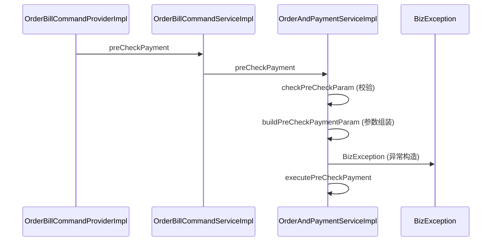

# Golden Case: preCheckPayment 调用链

## 输入：ExploreResponse（截取 main_paths 关键字段）

```json
{
  "project": { "name": "demo-scheme" },
  "query": { "type": "symbol", "text": "preCheckPayment" },
  "coverage": { "complete": false, "relation_budget_reached": true, "note": "本次返回预算内候选主链路" },
  "main_paths": [
    {
      "id": "main_path_1",
      "path_status": "verified",
      "confidence": "medium",
      "entry_symbol": "OrderBillCommandProviderImpl.preCheckPayment",
      "exit_symbol": "OrderAndPaymentServiceImpl.executePreCheckPayment",
      "nodes": [
        { "id": "n1", "symbol": "OrderBillCommandProviderImpl.preCheckPayment", "location_type": "service", "file": "src/main/java/.../OrderBillCommandProviderImpl.java", "start_line": 88 },
        { "id": "n2", "symbol": "OrderBillCommandServiceImpl.preCheckPayment", "location_type": "service", "file": "src/main/java/.../OrderBillCommandServiceImpl.java", "start_line": 55 },
        { "id": "n3", "symbol": "OrderAndPaymentServiceImpl.preCheckPayment", "location_type": "service", "file": "src/main/java/.../OrderAndPaymentServiceImpl.java", "start_line": 120 },
        { "id": "n4", "symbol": "OrderAndPaymentServiceImpl.executePreCheckPayment", "location_type": "service", "file": "src/main/java/.../OrderAndPaymentServiceImpl.java", "start_line": 200 }
      ],
      "relations": [
        { "from": "n1", "to": "n2", "relation_type": "calls" },
        { "from": "n2", "to": "n3", "relation_type": "calls" },
        { "from": "n3", "to": "n4", "relation_type": "calls" }
      ],
      "folded_steps": [
        { "parent_node_id": "n3", "node": { "symbol": "OrderAndPaymentServiceImpl.checkPreCheckParam" }, "reason": "validation" },
        { "parent_node_id": "n3", "node": { "symbol": "OrderAndPaymentServiceImpl.buildPreCheckPaymentParam" }, "reason": "parameter_assembly" },
        { "parent_node_id": "n3", "node": { "symbol": "BizException.BizException" }, "reason": "exception_construction" }
      ]
    }
  ]
}
```

## 期望输出（验收断言）

### 简化流程图（flowchart）

1. **节点顺序**：`ProviderImpl.preCheckPayment → CommandServiceImpl.preCheckPayment → OrderAndPaymentServiceImpl.preCheckPayment → executePreCheckPayment`。
2. **节点标签含类名**：每个节点 label 形如 `OrderAndPaymentServiceImpl.preCheckPayment`（无裸方法名）。
3. **不含折叠细节**：`checkPreCheckParam` / `buildPreCheckPaymentParam` / `BizException` **不出现在流程图节点/边里**（只在 `+N folded` 徽标）。
4. **entry/exit 徽标**：`▶ Entry: OrderBillCommandProviderImpl.preCheckPayment` + `■ Exit: OrderAndPaymentServiceImpl.executePreCheckPayment`。
5. **verified 线型**：`path_status=verified` → 实线边。
6. **coverage banner**：`complete=false` → 醒目「候选主流程，非完整运行时调用链」。

### 详细时序图（sequenceDiagram）

7. **participants**：`OrderBillCommandProviderImpl`、`OrderBillCommandServiceImpl`、`OrderAndPaymentServiceImpl`、`BizException`。
8. **主线消息**：`P->>C: preCheckPayment`、`C->>S: preCheckPayment`、`S->>S: executePreCheckPayment`。
9. **折叠细节消息**（按顺序）：`S->>S: checkPreCheckParam (校验)`、`S->>S: buildPreCheckPaymentParam (参数组装)`、`S->>BizException: BizException (异常构造)`。
10. **+3 folded**：简化流程图有 `+3 folded` 徽标；时序图把 3 项细节展开为消息。

参考时序图：



## 真实数据注意事项

真实 `code.explore_symbol` 的 **trace 路径**返回的节点 `symbol` 是**裸方法名**（如 `preCheckPayment`），不是上面的 `类名.方法名` 形式；类名在 `file`（`.../OrderBillCommandProviderImpl.java`）和 `id`（`Trace:...:Class.java:402:method`）里。

因此 SKILL 的类名提取规则是：**类名从 `node.file` 的 basename 取（去掉 `.java`），方法名从 `node.symbol` 取**，节点标签 = `类名.方法名`。详见 `references/explore-symbol-fields.md`。本 golden case 里输入用了完整 `symbol`，两种形式 SKILL 都要能正确处理。
