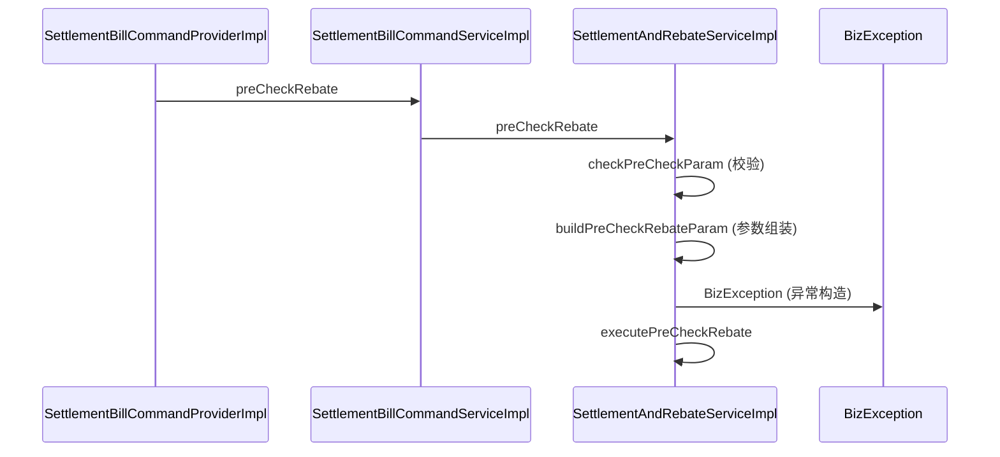

# Golden Case: preCheckRebate 调用链

## 输入：ExploreResponse（截取 main_paths 关键字段）

```json
{
  "project": { "name": "intl-scheme" },
  "query": { "type": "symbol", "text": "preCheckRebate" },
  "coverage": { "complete": false, "relation_budget_reached": true, "note": "本次返回预算内候选主链路" },
  "main_paths": [
    {
      "id": "main_path_1",
      "path_status": "verified",
      "confidence": "medium",
      "entry_symbol": "SettlementBillCommandProviderImpl.preCheckRebate",
      "exit_symbol": "SettlementAndRebateServiceImpl.executePreCheckRebate",
      "nodes": [
        { "id": "n1", "symbol": "SettlementBillCommandProviderImpl.preCheckRebate", "location_type": "service", "file": "src/main/java/.../SettlementBillCommandProviderImpl.java", "start_line": 88 },
        { "id": "n2", "symbol": "SettlementBillCommandServiceImpl.preCheckRebate", "location_type": "service", "file": "src/main/java/.../SettlementBillCommandServiceImpl.java", "start_line": 55 },
        { "id": "n3", "symbol": "SettlementAndRebateServiceImpl.preCheckRebate", "location_type": "service", "file": "src/main/java/.../SettlementAndRebateServiceImpl.java", "start_line": 120 },
        { "id": "n4", "symbol": "SettlementAndRebateServiceImpl.executePreCheckRebate", "location_type": "service", "file": "src/main/java/.../SettlementAndRebateServiceImpl.java", "start_line": 200 }
      ],
      "relations": [
        { "from": "n1", "to": "n2", "relation_type": "calls" },
        { "from": "n2", "to": "n3", "relation_type": "calls" },
        { "from": "n3", "to": "n4", "relation_type": "calls" }
      ],
      "folded_steps": [
        { "parent_node_id": "n3", "node": { "symbol": "SettlementAndRebateServiceImpl.checkPreCheckParam" }, "reason": "validation" },
        { "parent_node_id": "n3", "node": { "symbol": "SettlementAndRebateServiceImpl.buildPreCheckRebateParam" }, "reason": "parameter_assembly" },
        { "parent_node_id": "n3", "node": { "symbol": "BizException.BizException" }, "reason": "exception_construction" }
      ]
    }
  ]
}
```

## 期望输出（验收断言）

### 简化流程图（flowchart）

1. **节点顺序**：`ProviderImpl.preCheckRebate → CommandServiceImpl.preCheckRebate → SettlementAndRebateServiceImpl.preCheckRebate → executePreCheckRebate`。
2. **节点标签含类名**：每个节点 label 形如 `SettlementAndRebateServiceImpl.preCheckRebate`（无裸方法名）。
3. **不含折叠细节**：`checkPreCheckParam` / `buildPreCheckRebateParam` / `BizException` **不出现在流程图节点/边里**（只在 `+N folded` 徽标）。
4. **entry/exit 徽标**：`▶ Entry: SettlementBillCommandProviderImpl.preCheckRebate` + `■ Exit: SettlementAndRebateServiceImpl.executePreCheckRebate`。
5. **verified 线型**：`path_status=verified` → 实线边。
6. **coverage banner**：`complete=false` → 醒目「候选主流程，非完整运行时调用链」。

### 详细时序图（sequenceDiagram）

7. **participants**：`SettlementBillCommandProviderImpl`、`SettlementBillCommandServiceImpl`、`SettlementAndRebateServiceImpl`、`BizException`。
8. **主线消息**：`P->>C: preCheckRebate`、`C->>S: preCheckRebate`、`S->>S: executePreCheckRebate`。
9. **折叠细节消息**（按顺序）：`S->>S: checkPreCheckParam (校验)`、`S->>S: buildPreCheckRebateParam (参数组装)`、`S->>BizException: BizException (异常构造)`。
10. **+3 folded**：简化流程图有 `+3 folded` 徽标；时序图把 3 项细节展开为消息。

参考时序图：


