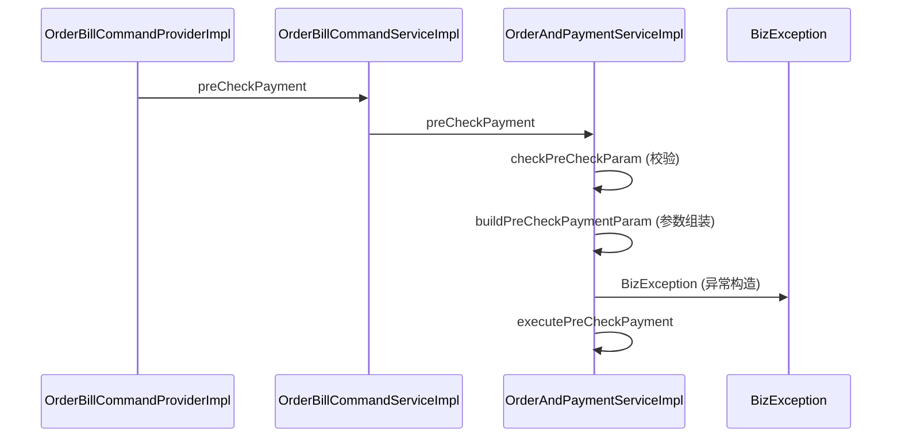

# folded_steps → 时序图消息映射

详细时序图（`sequenceDiagram`）把折叠细节展开为消息。映射规则：

## 1. participants

`main_path.nodes` 的类名去重 + `folded_steps` 的目标类名去重，按首次出现顺序。

类名 = `node.file` 的 basename 去掉 `.java`（**不要**用 `symbol` 取类名——trace 节点的 `symbol` 是裸方法名，如 `preCheckPayment`，不含类名）。方法名 = `node.symbol` 按 `.` 分割取最后一段。

```text
participant P as OrderBillCommandProviderImpl
participant S as OrderAndPaymentServiceImpl
```

## 2. 主线消息

对每条 relation（from→to），发一条消息，label = to 节点的简单方法名：

```text
FromClass ->> ToClass: calledMethod
```

若 from/to 同类 → 自调用：`S ->> S: executePreCheckPayment`。

## 3. 折叠细节消息

对每个有 folded_steps 的主节点，在它发出**下一条主线消息前**，按 folded_steps 顺序发消息：

- 同类折叠（folded 节点类 == 父节点类）：`Parent ->> Parent: method (reason标签)`
- 跨类折叠（folded 节点类 != 父节点类）：`Parent ->> FoldedClass: method (reason标签)`

reason 标签映射：

| reason | 标签 |
|---|---|
| validation | 校验 |
| parameter_assembly | 参数组装 |
| lock | 锁 |
| exception_construction | 异常构造 |
| dto_accessor | DTO访问 |
| utility | 工具 |
| test | 测试 |
| low_priority_detail | 细节 |

## 4. 代码位置（可选）

`Note right of X: file:line` 标注，避免过密。

## 5. 边界

- **side_relations 不进时序图**：imports / test_noise 是噪声，不是调用链细节。
- **时序图不区分 verified/candidate 线型**（sequenceDiagram 无虚线语义），在图 header 保留徽标。
- `reason` 不在上表时回退为 `细节`。

## 6. 完整示例

输入：nodes=[P.preCheckPayment, C.preCheckPayment, S.preCheckPayment, S.executePreCheckPayment]，folded(n3)=[checkPreCheckParam(validation), buildPreCheckPaymentParam(parameter_assembly), BizException(exception_construction)]

输出：


